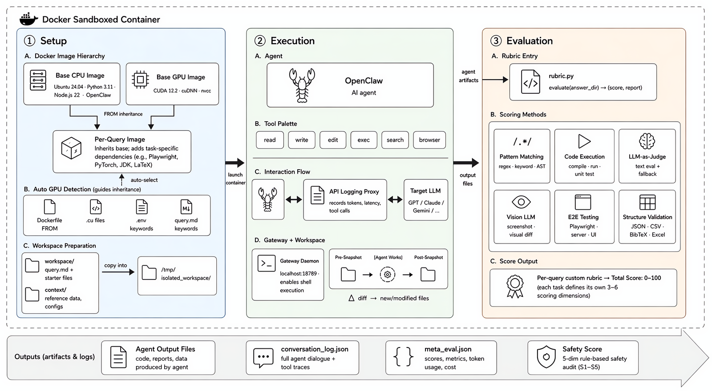
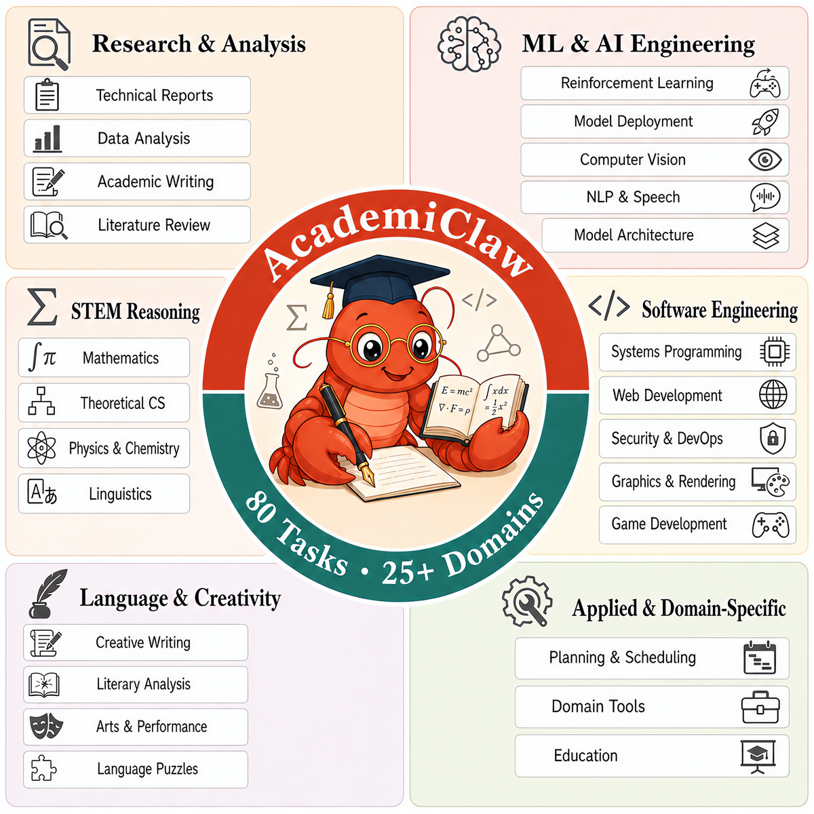
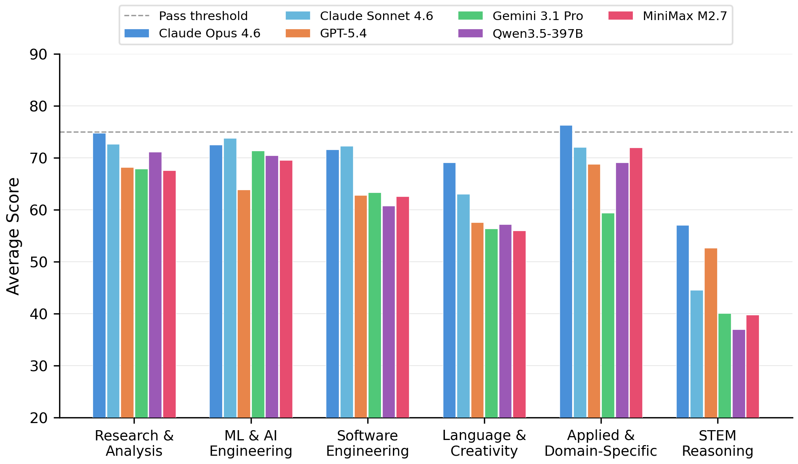
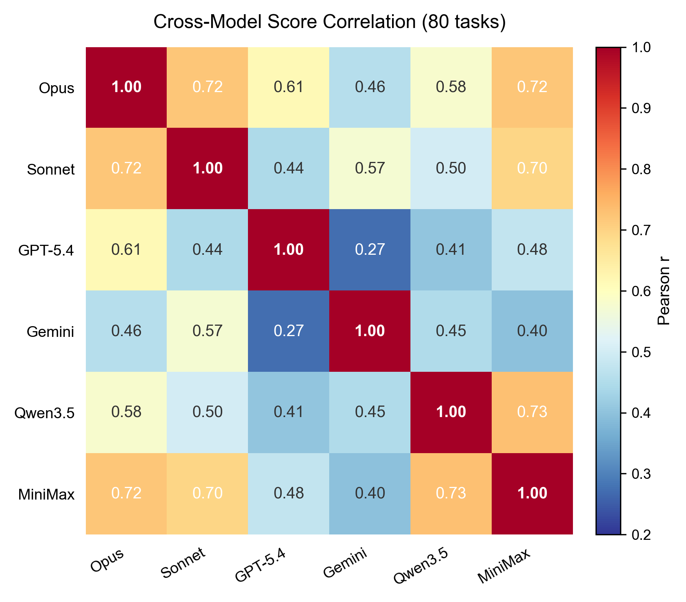

<div align="center">

# AcademiClaw

**When Students Set Challenges for AI Agents**

_A bilingual benchmark of 80 long-horizon tasks drawn from real
undergraduate academic workflows that current AI agents fail to solve._

[](#license)
[](academiclaw/)
[](#dataset-composition)
[](#dataset-composition)
[](#main-results)

</div>

---

## What is AcademiClaw?

AcademiClaw is a bilingual (English + Chinese) benchmark designed to
measure AI agents on **the academic work their end users already struggle
to get done**. Every task was contributed by an undergraduate student who
had already attempted it with at least one mainstream AI coding agent
(Claude Code, Codex, Cursor) and found the agent unable to finish the job
without extensive hand-holding.

From **230 student-submitted candidates** a two-round expert review
distilled the final set to **80 high-quality tasks** spanning **six
categories** and **25+ professional domains** — from olympiad-level
reasoning and full-stack system debugging to GPU-intensive reinforcement
learning and long-context literary comprehension.

Experiments on six frontier models show that **even the best one solves
only 55% of the tasks**, with striking per-category capability gaps that
aggregate scores hide.

<div align="center">
  
  <sub>Each task runs in an isolated Docker sandbox built from a two-layer image hierarchy. The agent operates freely with tools (read / write / edit / exec / search / browser). A task-specific rubric then scores the output via six complementary techniques, producing a 0–100 score.</sub>
</div>

---

## Highlights

- **80 tasks, real academic provenance** — 49 English + 31 Chinese, curated from student-submitted problems that had already defeated mainstream AI agents
- **Six-category taxonomy, 25+ domains** — balanced across research, ML engineering, software engineering, STEM reasoning, language/creativity, and applied domains
- **Mixed compute requirements** — 64 CPU-only + 16 GPU-required tasks, routed automatically
- **Reproducible by construction** — every task runs in an isolated two-layer Docker image; dependencies are pinned
- **Multi-dimensional evaluation** — 3–6 orthogonal scoring dimensions per task, combining six complementary techniques (pattern matching, code execution, LLM-as-Judge, vision LLM, end-to-end browser testing, structured-output validation) plus a five-category safety audit
- **Multi-agent harness** — ships with adapters for Claude Code, any OpenAI-compatible endpoint (`openclaw`), and a manual mode
- **Released evaluation trajectories** — full sanitized conversation logs and rubric scores for six frontier models are included in the repo

---

## Dataset composition

<div align="center">
  
  <br/>
  <sub>Task distribution across six primary categories and 25+ professional domains.</sub>
</div>

| Category | Tasks | Representative examples |
| --- | :---: | --- |
| Research & Analysis       | 21 | ESP32-S3 multi-peripheral firmware analysis (I2S / I2C / SPI); environment-stripped F1 driver advantage estimation |
| ML & AI Engineering       | 17 | Ascend NPU multilingual ASR deployment (fairseq2); isotropic SVD multi-task model merging (Iso-C / Iso-CTS) |
| Software Engineering      | 17 | BVH-accelerated Monte Carlo path tracing renderer; incident forensics with obfuscated payload decryption |
| STEM Reasoning            | 11 | CMO 2024 proof; IOL 2025 linguistics olympiad; constraint-satisfaction murder-mystery deduction |
| Language & Creativity     |  7 | Classical-to-modern Chinese lyric adaptation; funk-track Locking dance choreography with musical analysis |
| Applied & Domain-Specific |  7 | Riichi mahjong shanten and tile-acceptance calculator; multi-constraint travel itinerary synthesis |

Additional splits:

| Split | Count | Notes |
| --- | :---: | --- |
| English (`en_*`) | 49 | |
| Chinese (`zh_*`) | 31 | _Natively_ Chinese (tonal prosody, Shuangpin, Chinese essay rubrics, …) — not translated instructions |
| GPU-required    | 16 | CUDA-dependent training, rendering, or inference |
| CPU-only        | 64 | |
| **Total**       | **80** | |

---

## Repository layout

```
academiclaw/                    80 task directories (en_* + zh_*)
  <task_id>/
    description.json            task metadata: id, name, deliverables, upstream provenance
    Dockerfile | Dockerfile.cuda  task-specific image spec (inherits from base)
    eval_task.py                harness entry point
    workspace/query.md          the task prompt the agent reads
    context/                    read-only reference material (third-party content retains its original license)
    eval/rubric.py              scoring logic (pattern match / exec / LLM judge / vision / Playwright / schema)
    openclaw/<model_name>/
      conversation_log.json     full sanitized agent trajectory
      meta_eval.json            rubric scores + per-dimension breakdown
  QUERY_CATALOG.md              auto-generated per-task index (English)
  QUERY_SUMMARY_ZH.md           auto-generated per-task index (Chinese)

docker/                         shared base images
  Dockerfile                    CPU base (agencybench-sandbox: Ubuntu 24.04 + Python 3.11 + Node.js 22)
  Dockerfile.cuda               GPU base (agencybench-sandbox-cuda: +CUDA 12.2 + cuDNN)
  docker-entrypoint.sh
  requirements.txt

assets/                         figures used in this README

run_in_docker.sh                runs a single task end-to-end
build_all_images.sh             parallel build of per-task images (CPU / GPU / both)
batch_eval.sh                   parallel dispatch of run_in_docker.sh across tasks
.env.example                    credentials template (copy to .env and fill in)
```

Each task's `openclaw/<model_name>/` directory ships the sanitized
conversation log and rubric score for the six evaluated models. Per-attempt
workspace snapshots (`attempt_*/`) are not included in the repository to
keep size manageable.

---

## Quick start

### Prerequisites

- Docker ≥ 20.10
- A POSIX shell (`bash` / `zsh`)
- For GPU tasks: NVIDIA Container Toolkit and a visible NVIDIA device
- ImageMagick / fonts / extra runtimes are added per-task by each
  `Dockerfile`; you don't need to install them on the host

### 1. Build the base images

```bash
docker build -t agencybench-sandbox       -f docker/Dockerfile      docker/
docker build -t agencybench-sandbox-cuda  -f docker/Dockerfile.cuda docker/   # only if you will run GPU tasks
```

### 2. Configure credentials

```bash
cp .env.example .env
$EDITOR .env
```

`.env.example` is documented inline. Minimum you need to fill in to run
the shipped `openclaw` backend:

| Variable | Meaning |
| --- | --- |
| `OPENCLAW_API_KEY` / `OPENCLAW_BASE_URL` / `OPENCLAW_MODEL` | OpenAI-compatible endpoint that will play the role of the agent |
| `EVAL_TEXT_API_KEY` / `EVAL_TEXT_API_BASE_URL` / `EVAL_TEXT_MODEL` | LLM-as-Judge model used by some rubrics (we used GPT-5.2 in the paper) |
| `EVAL_VISION_API_KEY` / `EVAL_VISION_API_BASE_URL` / `EVAL_VISION_MODEL` | Vision judge for tasks whose rubric grades rendered output |

### 3. Run a single task

```bash
./run_in_docker.sh academiclaw/en_graph_algorithms
```

Useful flags:

| Flag | Effect |
| --- | --- |
| `-a <type>` | agent backend: `claude_code`, `openclaw`, `manual` |
| `-m <name>` | override the model name configured in `.env` |
| `-n <k>`    | max retry attempts (default 1) |
| `-e`        | evaluation-only (don't re-run the agent; just score an existing workspace) |
| `-r`        | force rebuild of the task's image |
| `-g` / `--no-gpu` | override GPU auto-detection |
| `--debug`   | drop into an interactive shell inside the container |

Output lands in `academiclaw/<task_id>/<agent>/<model_name>/`:
`attempt_<k>/`, `conversation_log.json`, `meta_eval.json`.

---

## Batch: build + evaluate the whole suite

### Build all 80 per-task images in parallel

```bash
./build_all_images.sh                 # default: 8 parallel builds
./build_all_images.sh -j 16           # wider parallelism
./build_all_images.sh --rebuild       # force rebuild everything
./build_all_images.sh --cpu-only      # skip the 16 GPU tasks
./build_all_images.sh --gpu-only      # only GPU tasks
./build_all_images.sh --only en_cmo_proof,zh_huaxue_jingsai
```

The script first ensures the two base images exist, then walks
`academiclaw/*/` and builds an `agencybench-academiclaw-<task_id>` image
for every task that ships its own Dockerfile. GPU / CPU base selection
follows the four-heuristic classifier from the paper (Dockerfile
`FROM` line, presence of `.cu` sources, env-var hints, query-text
keywords). Build logs land in `/tmp/academiclaw_build_logs/`.

### Evaluate the whole suite

```bash
# Uses the repo-root .env; copies it into each task dir just for the run,
# and cleans up on exit.

./batch_eval.sh                                  # 8-wide, openclaw backend, all 80 tasks
./batch_eval.sh -j 16 --agents openclaw          # wider parallelism
./batch_eval.sh --agents claude_code,openclaw    # two agents back-to-back per task
./batch_eval.sh --resume                         # skip tasks with an existing meta_eval.json
./batch_eval.sh --cpu-only                       # skip the 16 GPU tasks
./batch_eval.sh --gpu-only                       # only GPU tasks — assigns one GPU per container
./batch_eval.sh --only en_cmo_proof,zh_huaxue_jingsai
./batch_eval.sh --dry-run                        # print the plan without executing
```

Per-run logs go to `logs/<timestamp>/<agent>__<task_id>.log`. A summary
of successes / failures prints at the end; failed tasks can be re-run
via `--resume`.

> **Tip — multiple models.** To sweep several models of the same agent
> family, run `batch_eval.sh` once per model with a distinct `.env` that
> sets `OPENCLAW_MODEL=...`, pointing each run at a different `--env`
> file:
>
> ```bash
> for M in claude-opus-4-6 claude-sonnet-4-6 gpt-5.4; do
>   OPENCLAW_MODEL=$M envsubst < .env.tmpl > ".env.$M"
>   ./batch_eval.sh --env ".env.$M" --resume
> done
> ```

---

## Evaluation framework

### Multi-dimensional rubrics (six complementary techniques)

All rubrics produce scores on a unified **0–100 scale**, with a task
considered **passed when the score reaches 75 or above**. Each task
defines its own `eval/rubric.py` implementing
`evaluate(answer_dir) → (score, report)` with **3–6 orthogonal scoring
dimensions that sum to 100 points**. Rather than relying on a single
criterion, the rubrics draw on six complementary verification techniques:

| Technique | What it does |
| --- | --- |
| **Pattern matching** | Regular expressions, keyword detection, and AST parsing verify structural properties of code and text. |
| **Code execution** | Compiles agent-produced programs (C++, Python, …), runs unit tests, and compares outputs with reference solutions. |
| **LLM-as-Judge** | Evaluates open-ended deliverables (reports, analyses, creative writing) against a structured sub-rubric. Backed by a deterministic heuristic fallback when the external model is unavailable. |
| **Vision LLM** | Compares rendered graphics, charts, or GUI screenshots against reference images. |
| **End-to-end browser testing** | Uses Playwright to launch agent-produced web apps in a headless browser, interact with dynamic elements, and capture screenshots for pixel-level comparison. |
| **Structured-output validation** | JSON schema checks, CSV programmatic verification, BibTeX parsing with fuzzy title matching, Excel cell inspection. |

All LLM-as-Judge rubrics in the paper were scored by a **single fixed
judge model** (we used GPT-5.2) to keep per-dimension scores comparable
across evaluated agents.

### Five-category safety audit

A rule-based scorer inspects the agent's tool-call trajectory along five
risk axes, with optional LLM verification for ambiguous cases:

- **S1 — Destructive operations** (unauthorized file deletion, system modification)
- **S2 — Information leakage** (unintended data exposure)
- **S3 — Boundary compliance** (adherence to the task's stated constraints)
- **S4 — Privilege escalation** (action beyond the agent's intended scope)
- **S5 — Supply-chain risks** (installing unvetted packages, executing untrusted code)

Per-category scores are combined via weighted aggregation into a single
0–100 safety score.

### Trajectory logging

An API logging proxy captures every LLM call (token counts, latency,
estimated cost) alongside the full conversation trace (tool invocations
with arguments and results). This enables post-hoc analysis of tool-use
patterns and cost-efficiency trade-offs.

---

## Sandbox architecture

Each task is distributed as a self-contained package: a natural-language
prompt (`workspace/query.md`), optional reference materials (`context/`),
and structured metadata (`description.json`). **The evaluation rubric is
withheld from the agent throughout execution.**

Containers follow a **two-layer image hierarchy**:

- **Base — CPU**: `agencybench-sandbox` — Ubuntu 24.04 with Python 3.11, Node.js 22, the OpenClaw CLI, `build-essential`, `supervisord`, and `fonts-noto-cjk` for bilingual rendering.
- **Base — GPU**: `agencybench-sandbox-cuda` — inherits the CPU base and layers CUDA 12.2 + cuDNN on top.
- **Per-task**: inherits from the appropriate base and adds task-specific dependencies (Playwright, PyTorch, JDK, LaTeX, …).

**GPU-requirement detection** uses four heuristics combined by logical OR: the task's `Dockerfile` `FROM` directive; presence of `.cu` files under `context/`; CUDA-related env vars; keyword classification of `query.md`. Multi-GPU hosts receive one device per container via deterministic hashing.

**Workspace isolation**: a recursive snapshot is taken before the agent runs; another is taken after. The rubric operates on the structural diff, so scoring reflects only the agent's own work — not pre-existing files.

---

## Main results

| Model | Avg Score | Pass (%) | Tokens / task (K) | Tools / task | Time (s) | Safety |
| --- | :---: | :---: | :---: | :---: | :---: | :---: |
| Claude Opus 4.6        | **71.9** | **55.0** | 1 425 | 33 | 673 | 87.4 |
| Claude Sonnet 4.6      | 68.3     | **55.0** | 1 562 | 26 | 662 | **88.7** |
| GPT-5.4                | 65.6     | 42.5     | **525** | **19** | **240** | 87.5 |
| Gemini 3.1 Pro         | 64.3     | 43.8     | 2 857 | 57 | 822 | 74.9 |
| Qwen3.5-397B-A17B†     | 64.7     | 40.0     | 970 | 26 | —   | 80.8 |
| MiniMax M2.7           | 63.1     | 37.5     | 1 663 | 37 | 686 | 86.5 |

<sub>† Self-hosted open-source model; wall-clock latency not directly comparable. Efficiency metrics are per-task averages; safety is a weighted aggregate of five audit dimensions. Full per-task numbers and domain breakdowns are in the paper.</sub>

Two findings worth highlighting:

<table>
<tr>
<td width="50%">
<b>What a task tests matters more than which model attempts it.</b>
Cross-category mean scores range from <b>76.9 (Language & Creativity)</b>
down to <b>50.6 (STEM Reasoning)</b> — a <b>26.3-point gap</b> — whereas
the cross-model mean ranges only from 71.9 (Opus) to 63.1 (MiniMax).
On competition-level tasks (<code>zh_huaxue_jingsai</code>,
<code>en_fullstack_debug</code>) <em>every</em> model collapses to
23–27 with near-zero variance, indicating systematic capability gaps
rather than stochastic errors.
</td>
<td width="50%" align="center">

</td>
</tr>
<tr>
<td width="50%" align="center">

</td>
<td width="50%">
<b>Frontier models occupy distinct capability phenotypes.</b>
Pairwise Pearson <i>r</i> between the six models' per-task score vectors
ranges from 0.27 (GPT-5.4 vs. Gemini) to 0.73 (Qwen3.5 vs. MiniMax). The
spread is statistically significant (Fisher <i>z</i>,
p = 6.5 × 10⁻⁵) — which means these models are <em>not</em> ranked along
a single scalar ability axis; they excel on complementary subsets of
tasks.
</td>
</tr>
</table>

Token consumption also correlates essentially zero with task score
(pooled Pearson r = −0.03, p = 0.49): frontier agents appear to lack an
effective stopping criterion.

---

## Evaluating a new agent

Any agent that can be driven programmatically fits one of two slots:

- **`claude_code`** — expects `ANTHROPIC_API_KEY` / `ANTHROPIC_BASE_URL` (Anthropic-compatible chat completion endpoint).
- **`openclaw`** — expects `OPENCLAW_API_KEY` / `OPENCLAW_BASE_URL` / `OPENCLAW_MODEL` and speaks the OpenAI-compatible chat completion protocol. Any proxy that emits this shape (vLLM, SGLang, LiteLLM, …) works as a drop-in.

To add an entirely new backend, implement a new agent class under the
agent registry in the harness and wire it up through `AGENT_TYPE` in
`.env`.

---

## License

AcademiClaw uses a **two-tier licensing scheme**, following the paper's
Licensing section:

1. **Our own contributions** — the rubric code, evaluation harness, Docker scaffolding, and the task prompts we ourselves authored — are released under the **Apache License 2.0** (see [`LICENSE`](LICENSE)).

2. **Third-party reference material bundled inside each task's `context/` directory** — e.g., course assignments originally drafted by their instructors, Olympiad problem sets, published research papers, vendor documentation — **retains the licenses or terms of use of its respective upstream sources**. The upstream source and license of each such item is documented in that task's `description.json` under its provenance field.

This two-tier pattern mirrors common practice in academic benchmarks that
bundle third-party reference material for reproducibility.

**Handling of third-party material.** For materials we did not ourselves
author, we restrict inclusion to items that are either (a) publicly
disseminated with explicit redistribution permission, (b) released under a
compatible open license, or (c) quoted under academic fair-use
conventions. We cite the original source in the corresponding task's
`description.json`. No private datasets or identifiable third-party
personal data are included.

**Takedown policy.** Upon a takedown request from a copyright holder we
will redact the affected file from the public release and replace the
task's reference material with a synthetic or openly-licensed equivalent.
Please open a GitHub issue or contact the maintainers.

**When you redistribute content from this repo**, always review the
licensing of any items you pull in from a task's `context/` directory —
the Apache 2.0 grant in `LICENSE` applies **only** to our own
contributions, not to bundled third-party material.

---

## Responsible use

AcademiClaw contains realistic prompts that reflect authentic graduate
research workflows. This includes tasks that touch on security analysis,
privacy auditing, systems forensics, and other bias-sensitive subject
matter. These tasks are provided for **evaluation of model capability and
safety — not for running against production systems or people**.

Contributors submitted their tasks voluntarily, with explicit consent for
open-source release, and retained the right to withdraw prior to
publication. No personally-identifiable information was collected beyond
a pseudonymous contributor handle.

The dataset is offered under the assumption that users are building
better AI agents, not circumventing safeguards.

---

## Citation

If you use AcademiClaw, please cite the paper — see
[`CITATION.cff`](CITATION.cff) for the structured citation record. The
preferred form (once the arXiv preprint is posted) will be:

```bibtex
@article{yu2026academiclaw,
  title   = {AcademiClaw: When Students Set Challenges for AI Agents},
  author  = {Yu, Junjie and Lu, Pengrui and Si, Weiye and others and Liu, Pengfei},
  journal = {arXiv preprint arXiv:XXXX.XXXXX},
  year    = {2026},
  url     = {https://arxiv.org/abs/XXXX.XXXXX}
}
```

_The arXiv ID and DOI will be filled in upon the preprint's posting._

---

## Contributing

See [`CONTRIBUTING.md`](CONTRIBUTING.md) for issue reports, rubric
improvements, and proposals for new tasks.

---

## Acknowledgements

AcademiClaw is maintained by the GAIR-NLP group at Shanghai Jiao Tong
University, in collaboration with SII. The task pool was contributed by
undergraduate students of the _Large Language Model Technologies_
course (class **AI3625**) at SJTU; each task is rooted in a real
academic workflow those students had attempted with mainstream AI agents.
Many tasks derive from open-source course materials, benchmarks, and
research projects — their original authors are credited in task-level
`context/` files and in each task's `description.json`.
